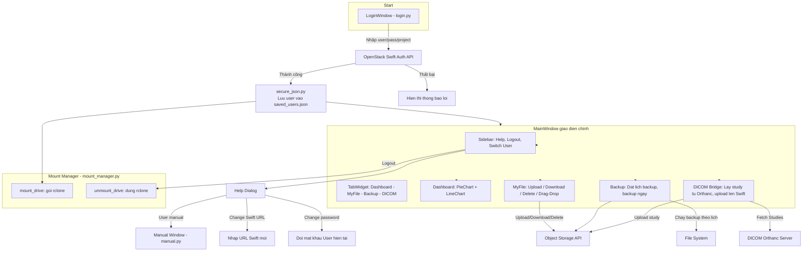

# BK Cloud
---- Hướng dẫn cài đặt app BK Cloud ----

Bước 1 : Cài đặt Sever Swift bằng Devstack hoặc Openstack để có địa chỉ URL đến Openstack Horizon Dashboard.

Bước 2 : Cài đặt 2 phần mềm phụ trong mục Supporting software.

Bước 3 : Thiết lập System environment theo như hướng dẫn trong hình.

Mở phần tìm kiếm tìm "Edit the system environment variables".

Theo như hướng dẫn từ 1 đến 4 trỏ đến thư mục đã cài 2 phần mềm ở bước hai như sau: Disk:\WinFsp\bin, Disk:\rclone\rclone-v1.70.2-windows-amd64

Bước 4: Khởi động app trong phần "src" bằng cách chạy file login.py. Người dùng cần phải thay đổi URL trong phần "Help" tại trang Login tùy theo cài đặt của người dùng ở bước 1.

* Trong phần Help của trang Login, người dùng có thể xem "User manual" để hiểu rõ hơn về app.

* Người dùng có thể build app thành 1 file duy nhất bằng cách:

pyinstaller --onefile --noconsole --add-data "photos;photos" --name BKcloud --icon=photos/applogo.ico login.py

# BK Cloud Architecture

