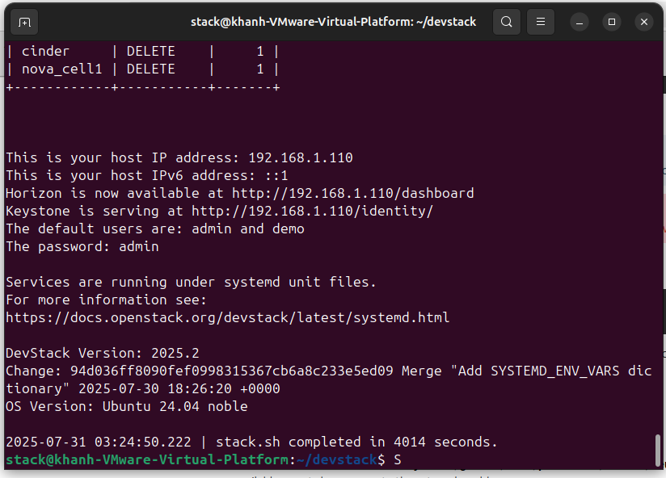

# BK Cloud
---- Hướng dẫn cài đặt Devstack Openstack swift trên máy ảo cho tester ----

Bước 1: Tạo user stack và gán quyền cho user đó

`sudo useradd -s /bin/bash -d /opt/stack -m stack`

`sudo chmod +x /opt/stack`

`echo "stack ALL=(ALL) NOPASSWD: ALL" | sudo tee /etc/sudoers.d/stack`

`sudo -u stack -i`

Bước 2: Thực hiện clone mã nguồn Devstack vào user đã tạo 

`git clone https://opendev.org/openstack/devstack`

`cd devstack`

Bước 3: Vào thư mục devstack copy file local.conf đã có vào

Bước 4: Thực hiện cài đặt Devstack

`./stack.sh`

Lưu ý: Việc gán ram qua ít cho máy ảo có thể gây ra lỗi cài đặt (Tối thiểu 12 GB)

Sau khi cài đặt Terminal sẽ hiện địa chỉ IP của trang Dashboard Horizon Openstack

Địa chỉ trong hình là 192.168.1.110 

Tài khoản và mật khẩu đăng nhập mặc định là: admin/admin. 

Trong phần app đã có phần thay đổi địa chỉ này tùy vào cài đặt của từng người dùng khác nhau.

Người dùng bấm vào “Help” để tiến hành thay đổi.

---- Hướng dẫn cài đặt app BK Cloud ----

Bước 1 : Cài đặt Sever Swift bằng Devstack hoặc Openstack để có địa chỉ URL đến Openstack Horizon Dashboard.

Bước 2 : Cài đặt 2 phần mềm phụ trong mục Supporting software.

Bước 3 : Thiết lập System environment theo như hướng dẫn trong hình.

Mở phần tìm kiếm tìm "Edit the system environment variables".

Theo như hướng dẫn từ 1 đến 5 trỏ đến thư mục đã cài 2 phần mềm ở bước hai như sau: Disk:\WinFsp\bin, Disk:\rclone\rclone-v1.70.2-windows-amd64

Bước 4: Khởi động app trong phần "src" bằng cách chạy file login.py. Người dùng cần phải thay đổi URL trong phần "Help" tại trang Login tùy theo cài đặt của người dùng ở bước 1.

* Trong phần Help của trang Login, người dùng có thể xem "User manual" để hiểu rõ hơn về app.

* Người dùng có thể build app thành 1 file duy nhất bằng cách:

`pyinstaller --onefile --noconsole --add-data "photos;photos" --name BKcloud --icon=photos/applogo.ico login.py`

* Người dùng có thể sử dụng app hoàn chỉnh bằng cách chạy file .exe trong thư mục dist

# BK Cloud Diagram

